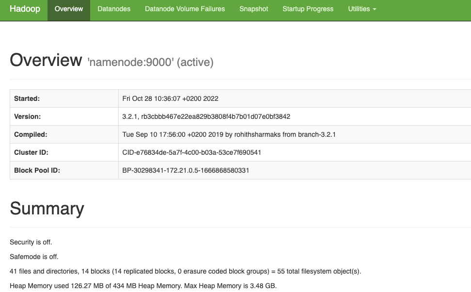

# BigData_Tutorial
Dies ist ein bewusst sehr kurz & einfach gehaltenes mini Tutorial zu HDFS, Spark und Hive. Es basiert auf der Vorarbeit von Marcel Jan (https://github.com/Marcel-Jan/docker-hadoop-spark) und den Docker images von Big Data Europe (https://github.com/big-data-europe)

Um das ganze Tutorial durchzuspielen, rechne mit ca. 30 Minuten. Die einzelnen Commands sind nicht weiter erläutert, da sie ziemlich selbsterklärend sein sollten, sofern du dich schon etwas mit Docker und Linux auskennst.

## Start der Umgebung

Wenn du das Repo lokal geklont hast, der Docker Daemon auf deinem System läuft, dann starte bitte die ganze Umgebung in einem Terminal mit:
```
docker-compose up
```
Dieser Prozess kann initial einige Minuten in Anspruch nehmen, da einerseits mehrere Docker Images geladen werden müssen und andererseits das Aufstarten der Umgebung eine gewisse Zeit dauert, bis alle Services operativ sind.

Bitte lass dieses Terminal mit dem laufenden `docker-compose` während dem Tutorial offen und beobachte was passiert, wenn du die HDFS / Spark / Hive Commands der Übungen unten eingibst.


## Web UIs
Die folgenden Web UIs werden wir im Tutorial verwenden:
* HDFS Namenode UI: http://localhost:9870/ 
* Spark Master UI:  http://localhost:8080/ 
* Spark Worker UI:  http://localhost:8081/ 

Navigiere zunächst etwas im Namenode UI herum und schau, welche Informationen du in den folgenden Tabs findest:
* Overview
* Datanodes
* Utilities
  * 'Browse the file system'

### Namenode Overview 


### Datanodes view


### Utilities 'Browse Directory' view


## HDFS 
In diesem Teil des Tutorial arbeiten wir in einem zweiten Terminal. Wir laden zunächst ein lokal vorhandenes File in einen Docker Container hoch, welcher Zugriff auf HDFS hat. Dann laden wir von diesem Docker Container aus das File ins HDFS:
1. `docker ps` 
1. `docker cp breweries.csv nodemanager:tmp/breweries.csv`
1. `docker exec -it nodemanager /bin/bash`
1. `hdfs dfs -ls /`
1. `hdfs dfs -mkdir -p /data/openbeer/breweries`
1. `hdfs dfs -put /tmp/breweries.csv /data/openbeer/breweries/breweries.csv`
1. `hdfs dfs -ls -R /data`

Achte zwischendurch auf das erste Terminal, wo du etwas zusehen kannst, was "im Cluster" passiert.

## Spark (pySpark)
Nun, da wir das file `breweries.csv` in HDFS liegen haben, können wir es mit PySpark einlesen und bearbeiten:

1. `docker ps` 
1. `docker exec -it spark-master /bin/bash`
1. `/spark/bin/pyspark --master spark://spark-master:7077`
1. `brewfile = spark.read.csv("hdfs://namenode:9000/data/openbeer/breweries/breweries.csv")`
1. `brewfile.show()`
1. `brewfile.printSchema()`
1. `brewfile = spark.read.option("header", True).csv("hdfs://namenode:9000/data/openbeer/breweries/breweries.csv")`
1. `brewfile.count()`
1. `brewfile.groupBy("state", "city").count().show()`

Weitere Beispiele zum selbst ausprobieren:
```
filter(), toDF(), sort(), etc.
```

### Spark Web UI 
Wenn du parallel zu der Spark Aufgabe das Web UI des Spark master & worker öffnest, siehst du den PySpark Process angezeigt.


Nach Beenden der Spark-Shell ist auch der Prozess im Spark Master beendet.


## Hive
Nebst Spark wollen wir auch einen kurzen Einblick in Hive haben. In Hive erstellen wir eine neue Datenbank sowie eine Tabelle mit den Daten des hochgeladenen Files. Dies geschieht hier, indem wir das `.hql` file direkt dem Hive Server zur Ausführung übergeben (5. Schritt unten). 

Danach wird hive interaktiv gestartet und sql commands können eingegeben werden.

Die Daten selbst liegen im angegebenen CSV, die Metadatan im Hive Warehouse:

1. `docker ps` 
1. `docker cp breweries_table.hql hive-server:tmp/breweries_table.hql`
1. `docker exec -it hive-server /bin/bash`
1. `cd /tmp/`
1. `hive -f breweries_table.hql` 
1. `hive`
1. `> show databases;`
1. `> use breweries;`
1. `> describe brewery;`
1. `> select name from brewery limit 10;`
1. `> select count(*) from brewery;`
1. `> select state, city, count(*) as count from brewery group by state, city sort by count desc limit 20;`

Insbesondere beim Berechnen der letzten, etwas komplizierteren Query solltet ihr im Terminal beobachten können, wie MapReduce Jobs aus der Query erstellt werden. Hier ein kleiner Ausschnitt, den ihr auch sehen sollten, direkt oberhalb der angezeigten Resultate der Query:
```
Query ID = root_20221028085224_bf7e756c-d728-42af-912d-f7c5ab39a37a
Total jobs = 3
Launching Job 1 out of 3
...
Ended Job = job_local251555801_0011
Launching Job 2 out of 3
---
Ended Job = job_local1549945497_0012
Launching Job 3 out of 3
...
Job running in-process (local Hadoop)
2022-10-28 08:52:27,859 Stage-3 map = 100%,  reduce = 100%
Ended Job = job_local1345091869_0013
MapReduce Jobs Launched:
Stage-Stage-1:  HDFS Read: 310448 HDFS Write: 0 SUCCESS
Stage-Stage-2:  HDFS Read: 310448 HDFS Write: 0 SUCCESS
Stage-Stage-3:  HDFS Read: 310448 HDFS Write: 0 SUCCESS
```

### Alternative mit Hiveserver2 und Beeline

Alternative Variante mit modernerem Hiveserver 2, manuell Tabelle anlegen:
1. `root@51a06b766366:/opt# hiveserver2`
   * `netstat -anp | grep 10000`
    ```
    tcp        0      0 0.0.0.0:10000           0.0.0.0:*               LISTEN      418/java
    ```

1. `beeline -u jdbc:hive2://localhost:10000 -n root`
1. `show databases;`
1. `create database openbeer;`
1. `use openbeer;`
1. ```
   CREATE EXTERNAL TABLE IF NOT EXISTS breweries(
    NUM INT,
    NAME CHAR(100),
    CITY CHAR(100),
    STATE CHAR(100),
    ID INT )
   ROW FORMAT DELIMITED
   FIELDS TERMINATED BY ','
   STORED AS TEXTFILE
   location '/data/openbeer/breweries';
   ```
1. `select name from breweries limit 10;`
1. Resp. die übrigen Hive Queries von oben auch mit Hiveserver 2 testen ;-)

### Verifikation der Metadaten in HDFS
Den neuen Eintrag der Breweries-DB Metadaten sehen wir nun auch in HDFS, unter dem Userhome des `hive` users::
```
hdfs dfs -ls -R /user
drwxr-xr-x   - root supergroup          0 2022-10-15 13:59 /user/hive
drwxrwxr-x   - root supergroup          0 2022-10-16 13:47 /user/hive/warehouse
drwxrwxr-x   - root supergroup          0 2022-10-16 13:47 /user/hive/warehouse/openbeer.db
```

## Stop der Umgebung
Stoppe den docker-compose Prozess in denselben Terminal, wo er noch aktiv ist mit: `ctrl-c`

Wenn du folgende Meldung im Terminal siehst, ist aller erfolgreich gestoppt:
```
^CGracefully stopping... (press Ctrl+C again to force)
Stopping resourcemanager           ... done
Stopping hive-server               ... done
Stopping historyserver             ... done
Stopping nodemanager               ... done
Stopping hive-metastore            ... done
Stopping spark-worker-1            ... done
Stopping spark-master              ... done
Stopping namenode                  ... done
Stopping datanode                  ... done
Stopping presto-coordinator        ... done
Stopping hive-metastore-postgresql ... done
```

Zur Sicherheit noch prüfen, ob wirklich alle docker container beendet sind und nichts mehr läuft mit: `docker ps`.
Es sollten keine der oben genannten Container mehr laufen.

Um Disk Space wieder freizugeben, kannst du die Docker images nun wieder löschen.

Wenn du noch etwas genauer wissen willst, wie diese kleine Tuturial Umgebung aufgebaut ist, schau in das `docker-compose.yml` File hinein. 
